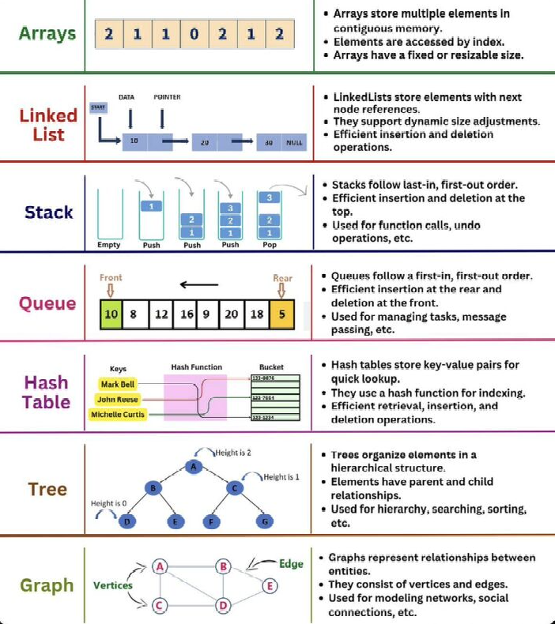

# DS

Data structures are ways to store and organize data efficiently. They determine the operations that can be performed and their efficiency in terms of time and space complexity.

## 

## 1. Arrays (Dynamic Array/List)

### Definition

An array is a contiguous block of memory storing elements of the same type. Dynamic arrays automatically resize when elements are added or removed.

### Operations

- **Access/Modify Element:** `O(1)`
- **Append/Remove from End:** `O(1)` (amortized)
- **Insert/Delete from Arbitrary Index:** `O(n)`
- **Check if Element Exists:** `O(n)`

### Example

```python
# Using a list in Python (Dynamic Array)
arr = [1, 2, 3, 4]
arr.append(5)  # O(1), adds 5 to the end of the array
arr.pop()      # O(1), removes and returns the last element
arr.insert(2, 99)  # O(n), inserts 99 at index 2, shifting elements to the right
```

---

## 2. Strings (Immutable)

### Definition

A string is a sequence of characters stored in a contiguous memory location. In many languages, strings are immutable.

### Operations

- **Access Element:** `O(1)`
- **Concatenation:** `O(n + m)`
- **Create Substring:** `O(m)`
- **Check if Substring Exists:** `O(n⋅k)`

### Example

```python
s = "hello"
print(s[1])  # O(1), prints 'e'
new_s = s + " world"  # O(n + m), s = hello worlds
substring = s[1:4]  # O(m), creates 'ell'
```

---

## 3. Linked Lists

### Definition

A linked list is a linear collection of nodes, where each node contains a value and a reference to the next node.

### Operations

- **Insert/Delete Given a Pointer:** `O(1)`
- **Insert/Delete Without Pointer:** `O(n)`
- **Access Element Without Pointer:** `O(n)`
- **Detect Cycle (Fast-Slow Pointers):** `O(n)`

### Example

```python
class Node:
    def __init__(self, val):
        self.val = val
        self.next = None

class LinkedList:
    def __init__(self):
        self.head = None

    def insert(self, val):
        new_node = Node(val)
        new_node.next = self.head
        self.head = new_node
```

---

## 4. Hash Table (Dictionary)

### Definition

A hash table maps keys to values using a hash function, providing efficient access.

### Operations

- **Insert/Delete Key-Value Pair:** `O(1)`
- **Check if Key Exists:** `O(1)`
- **Check if Value Exists:** `O(n)`

### Example

```python
# Using dictionary in Python
hash_map = {"a": 1, "b": 2}
hash_map["c"] = 3  # O(1)
print("a" in hash_map)  # O(1)
```

---

## 5. Set

### Definition

A set is an unordered collection of unique elements.

### Operations

- **Insert/Delete Element:** `O(1)`
- **Check if Element Exists:** `O(1)`

### Example

```python
# Using set in Python
s = {1, 2, 3}
s.add(4)  # O(1) s = {1, 2, 3, 4}
s.remove(2)  # O(1) s = {1, 3, 4}
print(3 in s)  # O(1) returns True
```

---

## 6. Stack

### Definition

A stack follows Last-In-First-Out (LIFO) ordering.

### Operations

- **Push (Insert Element):** `O(1)`
- **Pop (Remove Element):** `O(1)`
- **Peek (Top Element):** `O(1)`

### Example

```python
from collections import deque
stack = deque()
stack.append(1)  # Push
stack.append(2)
stack.pop()  # O(1)
```

---

## 7. Queue

### Definition

A queue follows First-In-First-Out (FIFO) ordering.

### Operations

- **Enqueue (Insert Element):** `O(1)`
- **Dequeue (Remove Element):** `O(1)`

### Example

```python
from collections import deque
queue = deque()
queue.append(1)  # Enqueue
queue.append(2)
queue.popleft()  # O(1)
```

---

## 8. Binary Tree

### Definition

A binary tree is a tree data structure where each node has at most two children.

### Operations

- **DFS/BFS Traversal:** `O(n)`
- **Insert/Delete/Search (BST):** `O(log n) (avg), O(n) (worst)`

### Example

```python
class TreeNode:
    def __init__(self, val):
        self.val = val
        self.left = None
        self.right = None
```

---

## 9. Heap (Priority Queue)

### Definition

A heap is a special tree where the parent node is always smaller (min-heap) or larger (max-heap) than its children.

### Operations

- **Insert Element:** `O(log n)`
- **Delete Min Element:** `O(log n)`
- **Find Min Element:** `O(1)`

### Example

```python
import heapq
heap = []
heapq.heappush(heap, 3)
heapq.heappush(heap, 1)
heapq.heappush(heap, 2)
print(heapq.heappop(heap))  # O(1), prints 1
```

---

## Summary Table

| Data Structure | Access | Insert   | Delete   | Search   |
| -------------- | ------ | -------- | -------- | -------- |
| Array          | O(1)   | O(1)     | O(n)     | O(n)     |
| Linked List    | O(n)   | O(1)     | O(1)     | O(n)     |
| Hash Table     | O(1)   | O(1)     | O(1)     | O(1)     |
| Set            | O(1)   | O(1)     | O(1)     | O(1)     |
| Stack          | O(1)   | O(1)     | O(1)     | O(n)     |
| Queue          | O(n)   | O(1)     | O(1)     | O(n)     |
| Binary Tree    | O(n)   | O(log n) | O(log n) | O(log n) |
| Heap           | O(n)   | O(log n) | O(log n) | O(n)     |

## References

1. [DS Image](https://www.linkedin.com/posts/ananya-mishra-3b612b235_datastructures-coding-programming-activity-7122931163379187713-rYg1/)
2. [Common DS](https://leetcode.com/explore/interview/card/cheatsheets/720/resources/4725/)
