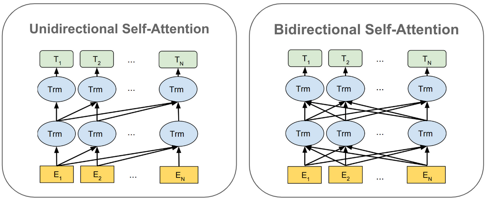
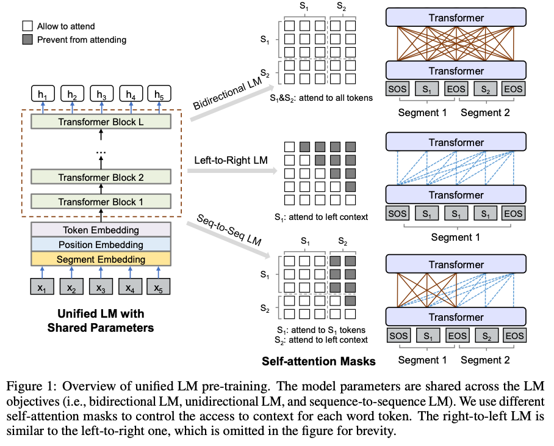

## Direction

- Unidirectional: processes data in a single direction (e.g., left-to-right or past-to-future), focusing on previous inputs only.
- Bidirectional: processes data in both forward and backward directions, utilizing both past and future context for better predictions.
  

## Regression

- Autoregression: predicts the next value in a sequence based on its own past values. Common in time-series models.
- Non-autoregression: predicts all values of a sequence simultaneously without depending on sequential history.

